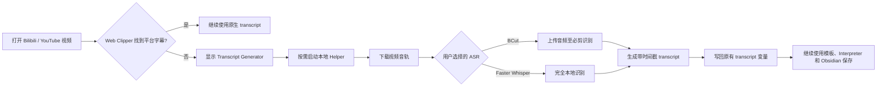

# Obsidian Web Clipper CN · Transcript


> [!IMPORTANT]
> 本项目仅支持 **macOS + Chrome/Chromium**。不支持 Windows 或 Linux，并且当前没有开发 Windows/Linux 版本的计划。

在 Obsidian Web Clipper CN 中补充无字幕视频的 transcript 生成能力。

Transcript Generator 不建立另一套笔记生成或保存流程。它只在 Bilibili / YouTube 视频没有平台字幕时，按需下载音轨并生成带时间戳的 transcript，然后把结果写回 Obsidian Web Clipper 原有的 `{{transcript}}` 变量。模板、Interpreter、属性和保存到 Obsidian 的流程仍由 Web Clipper 负责。

> 当前产品版本：`v0.2.1` 源码版。代码基线为 [Obsidian Web Clipper CN 1.4.6](https://github.com/nextcaicai/obsidian-clipper-cn/releases/tag/1.4.6)。已完成 macOS + Chrome/Chromium 的一键安装、覆盖安装和真实视频流程验证。本项目不计划提供预编译独立程序，安装与升级统一通过源码脚本完成。

## 版本号如何定义

- `v0.2.1` 是本项目自身的产品版本，同时写入浏览器扩展和 Transcript Helper。
- `1.4.6` 是 Obsidian Web Clipper CN 上游版本，只作为代码基线记录，不再混用为本项目版本。
- Obsidian 官方 Web Clipper、Web Clipper CN 和本项目各自独立发布，因此版本号本来就不会自动保持一致。
- 后续合并新的 CN 上游版本时，会更新“代码基线”；只有本项目发布功能或修复时，才更新产品版本。

旧构建曾把扩展版本写成 `1.7.1`，实际混用了 Obsidian 官方 Web Clipper 的版本号，并不代表本项目已经基于 Web Clipper CN 1.7.1。自 `v0.2.0` 起已改为独立版本规则。

## 为什么做 Transcript Generator

Obsidian Web Clipper 已经能够提取视频页面自带的字幕，并把字幕用于模板和 Interpreter。真正缺少的是：当视频没有平台字幕时，如何补齐 transcript。

BiliNote 提供了完整的视频笔记系统，但其数据库、GPT 总结、RAG、截图和前后端部署对于这个目标过重。Transcript Generator 只保留必要能力：

- Bilibili / YouTube 音轨下载
- BCut 在线 ASR
- Faster Whisper 本地 ASR
- Whisper 模型管理
- 临时 Cookies 转换
- transcript 缓存和临时文件清理

## 工作流程



## 设计原则

- 原生字幕优先：有平台字幕时不启动 Helper。
- 按需运行：不创建 LaunchAgent，不开机自启。
- 自动退出：Helper 空闲 15 分钟后自动停止，任务执行期间不会退出。
- 用户选择 ASR：BCut 与 Faster Whisper 不会未经用户确认互相回退。
- 任务状态可恢复：提交任务后可以关闭弹窗，扩展图标显示 `ASR`；重新打开原视频的剪藏界面会恢复进度和结果。
- 单一保存流程：生成结果只写回 `{{transcript}}`，不复制 Web Clipper 的模板和保存逻辑。
- Cookies 本地隔离：Cookies 仅保存在 `chrome.storage.local`，任务结束后删除临时 cookiefile。

## 功能

### 支持的平台

- Bilibili
- YouTube

### ASR

- BCut 在线 ASR
  - 无需下载本地模型
  - 直接使用必剪的非官方公开接口，无需也没有用户 API Key 配置
  - 音频会上传至必剪接口
  - 接口失败时不会自动切换到本地模型
- Faster Whisper 本地 ASR
  - 音频与识别过程保留在本机
  - 支持 `tiny`、`base`、`small`、`medium`、`large-v3`、`large-v3-turbo`
  - 模型未安装时阻止任务并引导用户下载

### Cookies

Bilibili 和 YouTube 分别支持：

- 自动读取浏览器 Cookies
- 手动导入 Cookie Header
- 手动导入 Netscape `cookies.txt`
- 不使用 Cookies

公开可访问的视频通常不需要 Cookies。登录限制、年龄限制、会员内容或地区限制的视频可能需要 Cookies。

在设置页选择“自动读取”后，点击“读取并验证”并批准 Chrome Cookies 权限；选择“手动导入”时，可粘贴请求头中的 Cookie 值或 Netscape `cookies.txt` 内容。页面会明确显示读取中、成功数量或失败原因。这里验证的是读取结果、格式和平台域名，账号权限是否仍有效由实际视频下载请求最终确认。

## 按需启动架构

本项目由三个组件组成：

```text
obsidian-web-clipper-cn-transcript/
├── extension/   # Chrome 扩展源码；安装后在其中生成 dist/
├── helper/      # 下载、ASR、模型和缓存服务
├── launcher/    # macOS Native Messaging 启动器
├── install.sh   # 一键安装和覆盖安装
└── update.sh    # Git 更新和覆盖安装
```

### 为什么 `extension` 下还有 `dist`

`extension/src` 是需要编译的 TypeScript、SCSS 和 HTML 源码，不能直接交给 Chrome 加载。运行 `install.sh` 后，Webpack 会把浏览器可以执行的 JavaScript、CSS、HTML、图标和 `manifest.json` 写入 `extension/dist`，Chrome 的“加载未打包的扩展程序”必须选择这个目录。

`dist`、`node_modules`、Python `.venv` 和本地缓存均由安装过程生成并被 Git 忽略，不包含在 GitHub 源码下载中。仓库不再生成独立 ZIP 构建包。

浏览器扩展不能直接执行本地程序，因此使用 Chrome Native Messaging 调用一次性 Launcher：

```text
浏览器扩展
    ↓ Native Messaging
transcript-launcher
    ↓ 按需启动
Transcript Helper (127.0.0.1:8484)
```

Launcher 只处理 `start`、`status`、`stop` 和 `restart`，执行完命令后立即退出。Helper 才负责视频任务，并在空闲后自动退出。

Helper 每次启动会生成临时会话令牌。扩展访问本地 API 时必须携带该令牌；无令牌访问会返回 HTTP 401。

## 安装与升级

### 环境要求（仅支持 macOS）

- macOS
- Chrome 或其他 Chromium 浏览器
- Node.js 18+
- [`uv`](https://docs.astral.sh/uv/)

本项目通过源码安装。用户不需要预先安装指定版本的 Python：安装脚本会让 `uv` 在项目专用目录中准备隔离的 Python 3.11 运行时。电脑上已有 Python 3.12、3.13 或更高版本不会冲突，也不会被替换。这里固定 Helper 运行时，是为了让 Faster Whisper、CTranslate2 和下载依赖使用经过验证的一致环境。

### 1. 一键安装或覆盖安装

首次安装时，先克隆仓库并进入仓库文件夹，再运行安装脚本：

```bash
git clone https://github.com/whatcccup/obsidian-web-clipper-cn-transcript.git
cd obsidian-web-clipper-cn-transcript
bash install.sh
```

如果源码已经下载到电脑，请先进入实际文件夹。例如 GitHub 压缩包通常解压为 `obsidian-web-clipper-cn-transcript-main`：

```bash
cd ~/Downloads/obsidian-web-clipper-cn-transcript-main
bash install.sh
```

脚本会完成以下操作：

- 检查 Node.js、npm 和 `uv`
- 构建 Chrome 扩展
- 安装按需 Helper 与 Native Messaging Host
- 明确保证不创建 LaunchAgent

如果检测到已经安装的 Transcript Helper，脚本会先询问是否覆盖。覆盖安装会更新 Helper、Launcher 和扩展构建产物，但不会删除：

- 浏览器中的 Transcript Generator 设置、Cookies 和模板
- `~/.cache/transcript-generator/` 中的 Whisper 模型
- transcript 缓存

覆盖安装也需要先进入新版源码文件夹：

```bash
cd /你的实际路径/obsidian-web-clipper-cn-transcript
bash install.sh --yes
```

扩展构建产物位于：

```text
extension/dist/
```

Helper 会安装到：

```text
~/Library/Application Support/TranscriptGenerator/
```

安装脚本会自动迁移 `v0.2.0` 使用的旧安装目录、模型缓存和 Native Messaging Host；扩展也会把旧浏览器存储键迁移到新的 `transcript_generator_*` 键。迁移不会删除 Cookies、模型、模板或任务设置。

并注册 Native Messaging Host：

```text
~/Library/Application Support/Google/Chrome/NativeMessagingHosts/cn.transcript.generator.launcher.json
```

安装脚本明确不会创建：

```text
~/Library/LaunchAgents/
```

### 2. 加载或重新加载扩展

1. 打开 `chrome://extensions`。
2. 启用“开发者模式”。
3. 首次安装：点击“加载未打包的扩展程序”，选择 `extension/dist/`。
4. 覆盖安装：在原扩展卡片上点击“重新加载”。固定扩展 ID 会保留已有本地配置；扩展会显示新名称“Obsidian Web Clipper CN · Transcript”。

### 后续更新

如果最初通过 Git clone 安装，先进入仓库目录，再运行：

```bash
cd /你的实际路径/obsidian-web-clipper-cn-transcript
bash update.sh
```

脚本只接受 Git 的 fast-forward 更新，然后自动执行覆盖安装。完成后打开 `chrome://extensions`，在原扩展卡片上点击“重新加载”。浏览器中的 Transcript Generator 设置、Cookies、模板、本地 Whisper 模型和 transcript 缓存会保留。

如果最初下载的是 GitHub 源码压缩包，请重新下载最新版源码并运行：

```bash
cd ~/Downloads/obsidian-web-clipper-cn-transcript-main
bash install.sh --yes
```

不要直接用 Obsidian Web Clipper CN 的 Release 文件覆盖 `extension/`，否则 Transcript Generator 的设置、按钮和 Helper 联动代码会被移除。

### Obsidian Web Clipper CN 上游更新

本项目对 Web Clipper CN 源码做了集成修改，上游新 Release 不能由普通用户直接叠加安装。更新分为两层：

1. 项目维护者跟踪 [Obsidian Web Clipper CN](https://github.com/nextcaicai/obsidian-clipper-cn) 的新版本，把上游改动合并到 `extension/`，解决冲突并完成普通剪藏、模板、Interpreter、原生字幕和 Transcript Generator 回归验证。
2. 验证完成后发布新的本项目版本；普通用户再运行 `bash update.sh` 更新。

这种方式不会让未经验证的上游改动直接覆盖 Transcript Generator。当前仓库是源码快照起步，与上游仓库没有可直接无冲突合并的共同 Git 历史，因此维护者需要按版本比较并移植上游变更，而不是让用户自行 `git merge`。

### 3. 启用 Transcript Generator

进入 Obsidian Web Clipper CN 设置页：

```text
Settings → Transcript Generator
```

然后：

1. 启用字幕生成。
2. 选择 BCut 或 Faster Whisper。
3. 如果选择 Faster Whisper，先下载模型。
4. 按需要配置 Bilibili / YouTube Cookies。

## 本地数据与隐私

| 数据 | 保存位置 | 是否同步 |
|---|---|---:|
| Transcript Generator 开关与 ASR 选择 | `chrome.storage.local` | 否 |
| Bilibili / YouTube Cookies | `chrome.storage.local` | 否 |
| Whisper 模型 | `~/.cache/transcript-generator/models/` | 否 |
| transcript 缓存 | `~/.cache/transcript-generator/transcripts/` | 否 |
| 临时音频与 cookiefile | 系统临时目录 | 任务结束后删除 |
| Helper 会话令牌 | 本机运行时文件，权限 `0600` | Helper 停止后失效 |

Cookies 不进入：

- `chrome.storage.sync`
- Web Clipper 设置导出
- 模板导出
- Helper 健康状态响应
- transcript 缓存
- 应用日志

BCut 模式会把音频上传至必剪；Faster Whisper 模式不会上传音频。两种模式不会自动互相回退。

## 构建与验证

底层 Helper 安装器主要用于开发和调试。检测到旧安装时，它不会静默覆盖；日常安装和升级请统一使用仓库根目录的 `install.sh`。

### 扩展

```bash
cd extension
npm install
npm run build:chrome
```

### Helper

```bash
cd helper
uv sync --python 3.11
uv run python -c "import transcript_helper.api"
```

目前已实际验证：

- Bilibili 音轨下载
- YouTube 音轨下载
- Bilibili → BCut → 时间戳字幕
- YouTube → Faster Whisper `base` → 时间戳字幕
- Helper 按需启动、停止和空闲退出
- Native Messaging 临时令牌认证
- 无令牌访问返回 HTTP 401

## 已知限制

- 本项目仅支持 macOS，不支持 Windows 或 Linux，当前没有开发其他桌面系统版本的计划。
- 当前源码安装仍依赖 Node.js 和 `uv`，还不是面向普通用户的零依赖安装包。
- BCut 使用非官方公开接口，接口可能随必剪服务变化。
- YouTube 下载能力依赖 `yt-dlp`，平台策略变化可能需要及时升级。
- Faster Whisper 大模型会占用较多磁盘、内存和处理时间。
- 仅保留 Chrome/Chromium 源码与构建流程，不提供 Firefox、Safari、CLI 或独立 API 发行版本。

## 项目来源与致谢

Obsidian Web Clipper CN · Transcript 是独立的社区衍生项目，核心思路和部分实现参考以下开源项目：

- [BiliNote](https://github.com/JefferyHcool/BiliNote) — 视频下载、BCut / Whisper 转写思路，MIT License
- [Obsidian Web Clipper CN](https://github.com/nextcaicai/obsidian-clipper-cn) — 中文内容增强版 Web Clipper，MIT License
- [Obsidian Web Clipper](https://github.com/obsidianmd/obsidian-clipper) — 原始 Web Clipper，MIT License
- [bcut-asr](https://github.com/SocialSisterYi/bcut-asr) — BCut API 调用方式，MIT License

详细版权与许可证声明见 [THIRD_PARTY_NOTICES.md](THIRD_PARTY_NOTICES.md)。

## 非官方声明

Obsidian Web Clipper CN · Transcript 不是 Obsidian、Bilibili、YouTube 或必剪的官方产品，也未获得这些平台的赞助或背书。

“Obsidian”、Bilibili、YouTube、必剪及相关名称、商标和图标属于各自权利人。用户应自行遵守平台服务条款、版权规则和所在地法律，仅处理自己有权访问和使用的内容。

## License

本项目自身代码采用 [MIT License](LICENSE)。

上游项目代码和第三方依赖仍分别受其原始许可证约束。Obsidian 的商标、图标、营销文案和其他品牌资产不包含在其源码 MIT License 中。

本仓库使用自有 Transcript Generator 图标；未分发上游项目的商店截图、营销图片或 Obsidian 品牌图标。
